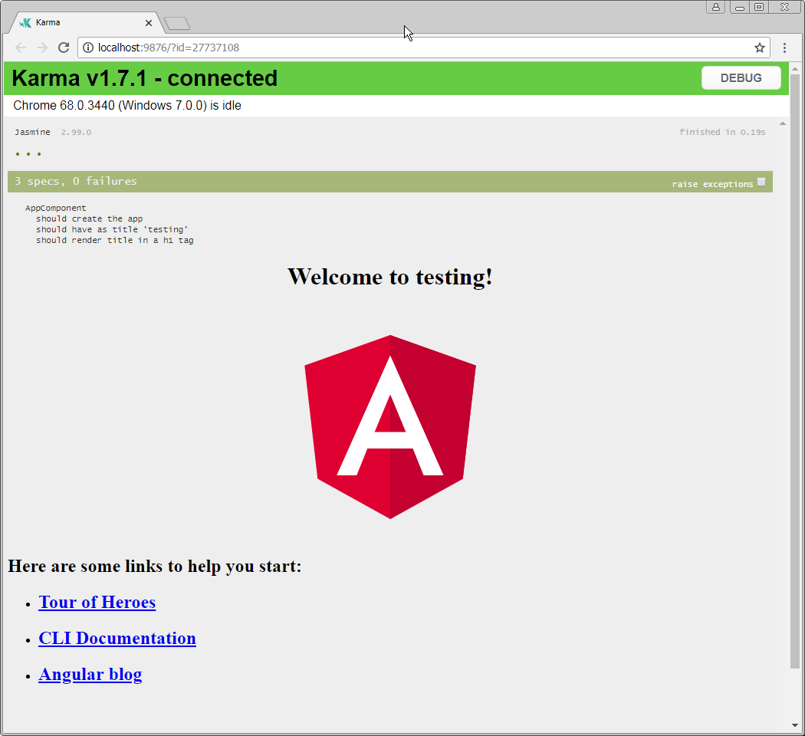

# 2. Run default tests

### Run the default unit tests with Karma and Jasmine <a id="title"></a>

* Run the default unit tests in src/app/app.component.spec.ts with the following command which will run all tests in the app folder in a file ending in .spec.ts

```text
ng test 
```



The tests are run in a chrome browser by default and you can see the default ui from Jasmine.




**Figure: Karma out put in terminal**

The default set up is nice and a huge help to get started quickly writing tests in your application but we will also look at wallaby later which can make getting realtime feedback in the IDE much quicker and better.  
The tests that run here are the default tests the Angular CLI create for you. You can and we often do pass a flag in when generating code with the CLI to not auto create tests until we want them as they often break as soon as you inject your first dependency into an Angular component.

```text
ng generate component test-component --spec false
```

NOTE: above command will tell the CLI not to auto generate test code for the component being made

* Run the default e2e tests in e2e/app.e2e-spec.ts with the following command which will run all e2e tests in the e2e folder in a file ending in .e2e-spec.ts

```text
ng serve 
```

then in another terminal run or it will fail as the application needs to be running for protractor.


If you are behind a fire wall you may need to update protractor's webdrivers with the blow commands. You may need to restart VS Code.

```text
npm i npx -g
npx webdriver-manager update --ignore_ssl --proxy YOUR_PROXY_ADDRESS
```


```text
ng e2e
```


**Figure: Protractor out put in terminal**

There is no nice realtime feedback for e2e tests as they are slow to run and normally run on a CI \(Continuous integration\) setup versus as you code.

